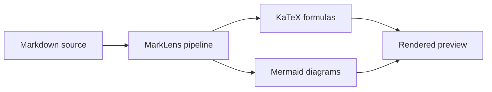

# Main markdown

## Description

```markdown
# title

a very long sentence.

List of work:

- task 1
- task 2 - fix `code`
- task 3

```swift
let a = 1.0
```

```

## Mermaid diagram rendering



## Inline math

Arrow: $\rightarrow$

Other arrows: $\leftarrow$, $\Rightarrow$, $\leftrightarrow$

Greek letters: $\alpha + \beta = \gamma$

Relations: $x \leq y$, $a \neq b$, and $p \in S$

Markdown-safe fraction: $`\frac{1}{2}`$

Mixed with formatting: **Euler's identity is $e^{i\pi} + 1 = 0$.**

## Display math

$$
E = mc^2
$$

$$
\frac{-b \pm \sqrt{b^2 - 4ac}}{2a}
$$

## Fenced math

```math
\sum_{i=1}^{n} i = \frac{n(n+1)}{2}
```

```math
\begin{pmatrix}
a & b \\
c & d
\end{pmatrix}
```

## Long display equation

The following should remain usable without overflowing the document layout:

$$
\int_{-\infty}^{\infty} e^{-x^2}\,dx = \sqrt{\pi}
\qquad\Longrightarrow\qquad
\left(\int_{-\infty}^{\infty} e^{-x^2}\,dx\right)^2 = \pi
$$
